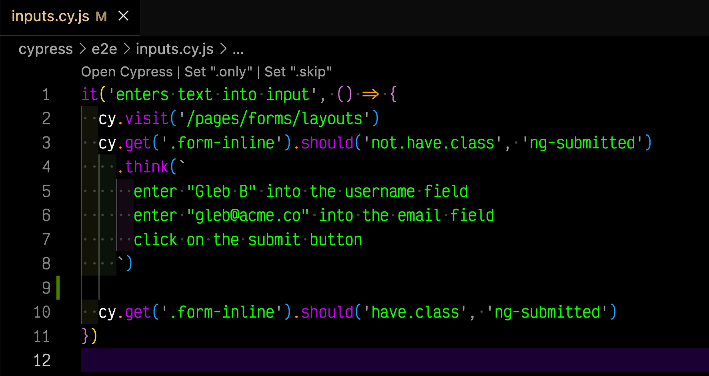

# cypress-think

> Create Cypress tests using your own AI

Given `cy.think(...)` command, comes up with accurate Cypress commands line by line

Produces the following test, see line by line generated commands

Not ready to be reusable yet.

See [LICENSE.md](./LICENSE.md)
