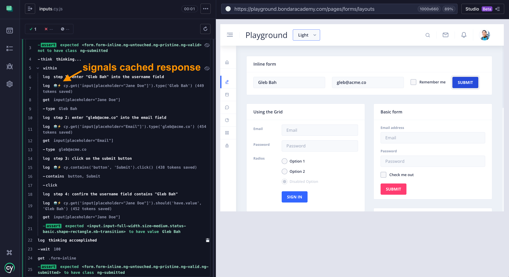
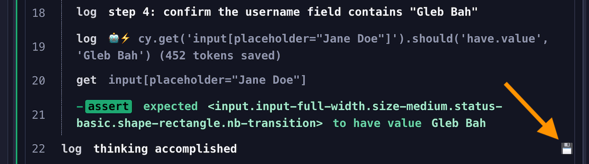
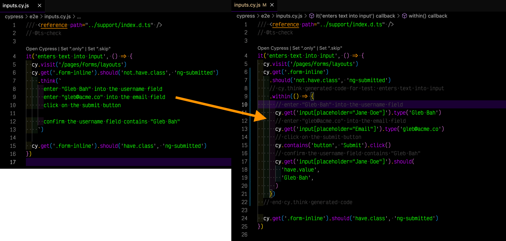

# <span style="color: red; font-size: 2em;">⚠️ Not ready to be used yet.</span>

---

# cypress-think

> Create Cypress tests using your own AI

📺 Watch [Introducing cypress-think](https://youtu.be/3qn6QEj2PQ4).

Given `cy.think(...)` command, comes up with accurate Cypress commands line by line


Produces the following test, see line by line generated commands


## Agent instructions

This package automatically discovers your agent instructions and includes them with your prompts, see [agent-instructions.mjs](./src/agent-instructions.mjs)

```
Found agent instructions in: .github/copilot-instructions.md
```

## Caching

Each prompt line is processed separately. Each result is cached to avoid reinventing the same code. If the line changes, it will be re-generated.



The cache is loaded and saved in the local `thoughts.json` file.

## Saving generated code

If the entire prompt finishes successfully, a save icon 💾 appears next to the "thinking" log message

Save replaces the original `.think(prompt)` with the generated `.within(...)` commands plus comments



Here is before and after spec file



## Debugging

This plugin uses [debug]() to output debug logs to STDERR.

```bash
# show debug logs: commands, results
$ DEBUG=cypress-think npx cypress open
# show HTML sent to the model (verbose)
$ DEBUG=cypress-think:html npx cypress open
```

See [LICENSE.md](./LICENSE.md)
